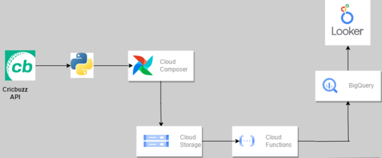

# 🏏 Batsmen Ranking Data Pipeline using Google Cloud

This project builds a complete data pipeline that fetches **Test cricket batsmen rankings** from the Cricbuzz API and loads it into **Google BigQuery**, using **Google Cloud Functions**, **Cloud Storage**, and Python. The pipeline ends with a clean and interactive **Looker Studio Dashboard** for country-wise filtering and visualization.

---

## 📌 Project Overview

**Objective:** Automate the collection and transformation of real-time batsmen rankings and store it in BigQuery for analysis and dashboarding.

**Technologies Used:**
- 🐍 Python (Data Fetch & Transformation)
- ☁️ Google Cloud Functions (Serverless Compute)
- 🗃 Google Cloud Storage (Object Storage)
- 📊 BigQuery (Data Warehouse)
- 📈 Looker Studio (Visualization)

---

## 🧱 Architecture



---

## 🔄 Pipeline Steps

### 1. **Data Extraction using Python**
- API used: [Cricbuzz Cricket API (via RapidAPI)](https://rapidapi.com/)
- The Python script `extract_and_push_gcs.py` fetches batsmen rankings and:
  - Extracts `rank`, `name`, and `country`
  - Saves it as a CSV file: `batsmen_rankings.csv`
  - Uploads the CSV to a GCS bucket

### 2. **Cloud Function Trigger**
- Cloud Function (`function.py`) is automatically triggered when a new CSV is uploaded to GCS.
- It loads the data from GCS to BigQuery (`cricket_data.icc_odi_batsmans_ranking` table).
- The function uses autodetect schema and replaces old data.

### 3. **Data Loading in BigQuery**
- Data is loaded using the `bigquery` client with proper schema detection and table overwrite.
- Enables structured querying and supports integration with BI tools.

### 4. **Interactive Dashboard in Looker Studio**
- The BigQuery table is connected to Looker Studio.
- Users can filter rankings by **country** and visualize insights.
  


---

## 📂 Repository Contents

| File | Description |
|------|-------------|
| `extract_and_push_gcs.py` | Fetches data from API, saves CSV, uploads to GCS |
| `function.py` | Google Cloud Function to load CSV from GCS to BigQuery |
| `batsmen_rankings.csv` | Sample output from the API |
| `Architecture.png` | Project architecture diagram |
| `Dashboard.png` | Screenshot of Looker dashboard |
| `requirements.txt` | Python dependencies |
| `desktop.ini` | System file (can be ignored or removed) |

---

## 🚀 How to Run

### ✅ Prerequisites
- Google Cloud project with billing enabled
- `gcloud` CLI configured
- BigQuery dataset created (e.g., `cricket_data`)
- GCS bucket created (e.g., `buck-ranking-data`)
- Enable Cloud Functions, Storage, and BigQuery APIs

### 🛠 Steps

1. **Install dependencies**
   ```bash
   pip install -r requirements.txt

